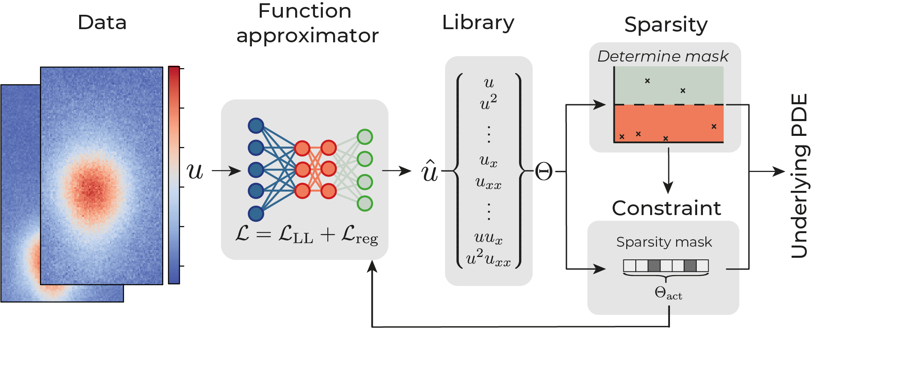

# Background

## Framework

Deep learning-based model discovery typically uses a neural network to construct a noiseless surrogate $\hat{u}$ of the data $u$. A library of potential terms $\Theta$ is constructed using automatic differentiation from $\hat{u}$ and the neural network is constrained to solutions allowed by this library . The loss function of the network thus consists of two contributions, (i) a mean square error to learn the mapping $(\vec{x},t) \rightarrow \hat{u}$ and (ii) a term to constrain the network,

$\mathcal{L} = \frac{1}{N}\sum_{i=1}^{N}\left( u_i - \hat{u}_i \right) ^2 +\frac{1}{N}\sum_{i=1}^{N}\left( \partial_t \hat{u}_i - \Theta_{i}\xi \right)^2 .$

 The sparse coefficient vector $\xi$ is learned concurrently with the network parameters and plays two roles: 1) determining the active (i.e. non-zero) components of the underlying PDE and 2) constraining the network according to these active terms. We propose to separate these two tasks by decoupling the constraint from the sparsity selection process itself. We first calculate a sparsity mask $g$ and then constrain the network only by the active terms in the mask. Mathematically, we replace $\xi$ by $\xi \circ \ g$. The sparsity mask $g$ need not be calculated differentiably, so that any classical, non-differentiable sparse estimator can be used. Our approach has several additional advantages: i) It provides an unbiased estimate of the coefficient vector since we do not apply $l_1$ or $l_2$ regularisation on $\xi$, ii) the sparsity pattern is determined from the full library $\Theta$, rather than only from the remaining active terms, allowing dynamic addition and removal of active terms throughout training, and iii) we can use cross validation or similar methods in the sparse estimator to find the optimal hyperparameters for model selection.

Using this change, we constructed a general framework for deep learning based model discovery with any classical sparsity promoting algorithm in the above. A *function approximator* constructs a surrogate of the data, (II) from which a *Library* of possible terms and the time derivative is constructed using automatic differentiation. (III) A *sparsity estimator* selects the active terms in the library using sparse regression and (IV) the function approximator is constrained to solutions allowed by the active terms by the *constraint*.

## Training

As the sparsity estimator is non-differentiable, determining the sparsity mask before the function approximator has reasonably approximated the data can adversely affect training if the wrong terms are selected. We thus split the dataset into a train- and test-set and update the sparsity mask only when the MSE on the test-set starts to increase. After updating the mask, the model needs to adjust to the tighter constraint and we hence update the sparsity pattern every 25 epochs after the first update. Final convergence is reached when the $l_1$ norm of the coefficient vector remains constant. In practice we observe that large datasets with little noise might discover the correct equation after a single sparsity update, but that highly noisy datasets typically require several updates, removing only a few terms at a time.