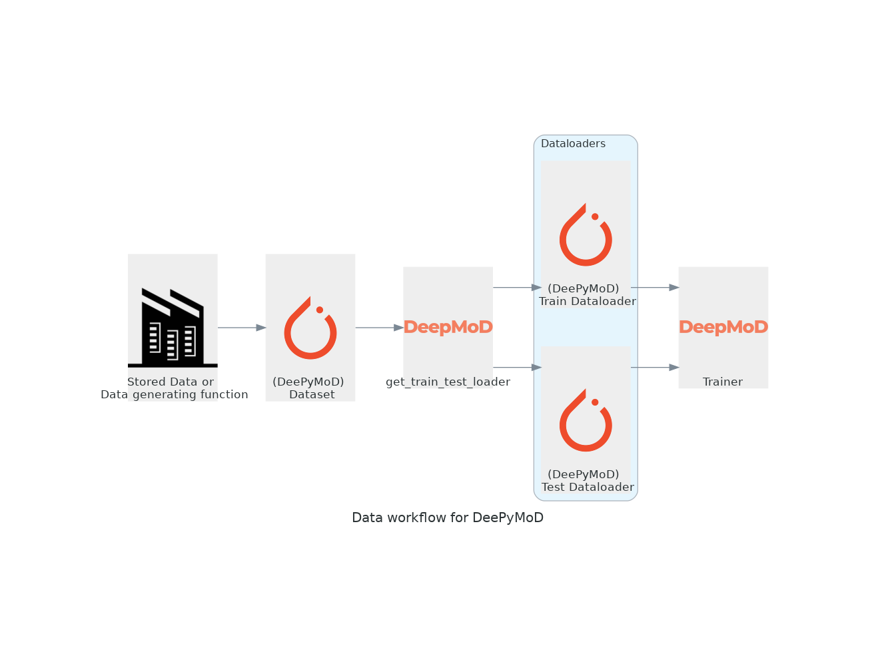

# Datasets

## The general workflow

The custom DeePyMoD dataset and dataloaders are created for data that typically fits in the RAM/VRAM during training, if this is not your use case, they are interchangeable with the PyTorch general [Datasets](https://pytorch.org/docs/stable/data.html#torch.utils.data.Dataset) and 
 and [Dataloaders](https://pytorch.org/docs/stable/data.html#torch.utils.data.Dataset).

For model discovery we typically want to add some noise to our dataset, normalize certain features and ensure it is in the right place for optimal PyTorch performance. This can easily be done by using the custom `deepymod.data.Dataset` and `deepymod.data.get_train_test_loader`. An illustration of the workflow is shown below:



## The dataset
The dataset needs a function that loads all the samples and returns it in a coordinate, data format. 
```python
def load_data():
    # create or load your data here
    return coordinates, data
``` 
Here it is important that the last axis of the data is the number of features, even if it is just one. The dataset accepts data that is still dimensionful `(t,x,y,z,number_of_features)` as well as data that is already
flattened `(number_of_samples, number_of_features)`. After returning the data tries to apply the following functions to the samples that were just loaded: `preprocessing`, `subsampling` and lastly `shuffling`. 

### Preprocessing
The preprocessing performs steps commonly used in the framework, normalizing the coordinates, normalizing the data and adding noise to the data. One can provide these choices via a dictionary of arguments: 
```python
preprocess_kwargs: dict = {
            "random_state": 42,
            "noise_level": 0.0,
            "normalize_coords": False,
            "normalize_data": False,
        }
```
And we can override the way we preprocess functions by defining the preprocess functions `apply_normalize`, `apply_noise` or even the way we shuffle using `apply_shuffle`. 

### Subsampling
Sometimes we do not wish to use the whole dataset, and as such we can subsample it. Sometimes using a subset
of the time snapshots available is enough, for this we can use `deepymod.data.samples.Subsample_time` or
randomly with `deepymod.data.samples.Subsample_random`. You can provide the arguments for these functions via `subsampler_kwargs` to the Dataset.

### The resulting shape of the data
Since for random subsampling the (number_of_samples, number_of_features) format is better and for spatial 
subsampling the (t,x,y,z,number_of_features) format is best, we accept both formats. However since the trainer
can only work with (number_of_samples, number_of_features), we will reshape the data to this format once
the data is preprocessed and subsampled. After this we can shuffle the data. 

### Shuffling
If the data needs to be shuffled, `shuffle=True` can be used

## Dataloaders
Dataloaders are used in the PyTorch framework to ensure that the loading of the data goes smoothly, 
for example with multiple workers. We however can typically fit the whole dataset into memory once, 
so the overhead of the PyTorch Dataloader is not needed. We thus provide the Loader, which provides 
a wrapper around the dataset. The loader will return the entire batch at once.

## Obtaining the dataloaders 
In order to create a train and test split, we can use the function `get_train_test_loader`, which divides
the dataset into two pieces, and then directly passes them into the loader.


