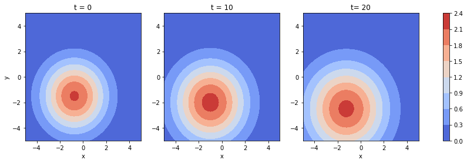

# 2D Advection-Diffusion equation

in this notebook we provide a simple example of the DeepMoD algorithm and apply it on the 2D advection-diffusion equation. 


```python
# General imports
import numpy as np
import torch
import matplotlib.pylab as plt

# DeepMoD functions

from deepymod import DeepMoD
from deepymod.model.func_approx import NN
from deepymod.model.library import Library2D
from deepymod.model.constraint import LeastSquares
from deepymod.model.sparse_estimators import Threshold,PDEFIND
from deepymod.training import train
from deepymod.training.sparsity_scheduler import TrainTestPeriodic
from scipy.io import loadmat

# Settings for reproducibility
np.random.seed(42)
torch.manual_seed(0)


%load_ext autoreload
%autoreload 2
```

## Prepare the data

Next, we prepare the dataset.


```python
data = loadmat('data/advection_diffusion.mat')
usol = np.real(data['Expression1'])
usol= usol.reshape((51,51,61,4))

x_v= usol[:,:,:,0]
y_v = usol[:,:,:,1]
t_v = usol[:,:,:,2]
u_v = usol[:,:,:,3]
```

Next we plot the dataset for three different time-points


```python
fig, axes = plt.subplots(ncols=3, figsize=(15, 4))

im0 = axes[0].contourf(x_v[:,:,0], y_v[:,:,0], u_v[:,:,0], cmap='coolwarm')
axes[0].set_xlabel('x')
axes[0].set_ylabel('y')
axes[0].set_title('t = 0')

im1 = axes[1].contourf(x_v[:,:,10], y_v[:,:,10], u_v[:,:,10], cmap='coolwarm')
axes[1].set_xlabel('x')
axes[1].set_title('t = 10')

im2 = axes[2].contourf(x_v[:,:,20], y_v[:,:,20], u_v[:,:,20], cmap='coolwarm')
axes[2].set_xlabel('x')
axes[2].set_title('t= 20')

fig.colorbar(im1, ax=axes.ravel().tolist())

plt.show()
```





We flatten it to give it the right dimensions for feeding it to the network:


```python
X = np.transpose((t_v.flatten(),x_v.flatten(), y_v.flatten()))
y = np.float32(u_v.reshape((u_v.size, 1)))
```

We select the noise level we add to the data-set


```python
noise_level = 0.01
```


```python
y_noisy = y + noise_level * np.std(y) * np.random.randn(y.size, 1)
```

Select the number of samples:


```python
number_of_samples = 1000

idx = np.random.permutation(y.shape[0])
X_train = torch.tensor(X[idx, :][:number_of_samples], dtype=torch.float32, requires_grad=True)
y_train = torch.tensor(y[idx, :][:number_of_samples], dtype=torch.float32)


```

## Configuration of DeepMoD

Configuration of the function approximator: Here the first argument is the number of input and the last argument the number of output layers.


```python
network = NN(3, [50, 50, 50,50], 1)
```

Configuration of the library function: We select athe library with a 2D spatial input. Note that that the max differential order has been pre-determined here out of convinience. So, for poly_order 1 the library contains the following 12 terms:
* [$1, u_x, u_y, u_{xx}, u_{yy}, u_{xy}, u, u u_x, u u_y, u u_{xx}, u u_{yy}, u u_{xy}$]


```python
library = Library2D(poly_order=1) 
```

Configuration of the sparsity estimator and sparsity scheduler used. In this case we use the most basic threshold-based Lasso estimator and a scheduler that asseses the validation loss after a given patience. If that value is smaller than 1e-5, the algorithm is converged.  


```python
estimator = Threshold(0.1) 
sparsity_scheduler = TrainTestPeriodic(periodicity=50, patience=10, delta=1e-5) 
```

Configuration of the sparsity estimator 


```python
constraint = LeastSquares() 
# Configuration of the sparsity scheduler
```

Now we instantiate the model and select the optimizer 


```python
model = DeepMoD(network, library, estimator, constraint)

# Defining optimizer
optimizer = torch.optim.Adam(model.parameters(), betas=(0.99, 0.99), amsgrad=True, lr=1e-3) 

```

## Run DeepMoD 

We can now run DeepMoD using all the options we have set and the training data:
* The directory where the tensorboard file is written (log_dir)
* The ratio of train/test set used (split)
* The maximum number of iterations performed (max_iterations)
* The absolute change in L1 norm considered converged (delta)
* The amount of epochs over which the absolute change in L1 norm is calculated (patience)


```python
train(model, X_train, y_train, optimizer,sparsity_scheduler, log_dir='runs/2DAD/', split=0.8, max_iterations=100000, delta=1e-4, patience=8) 
```

    | Iteration | Progress | Time remaining |     Loss |      MSE |      Reg |    L1 norm |
           7000      7.00%            3733s   1.07e-04   3.60e-05   7.08e-05   1.87e+00 Algorithm converged. Stopping training.


Sparsity masks provide the active and non-active terms in the PDE:


```python
model.sparsity_masks
```


    [tensor([False,  True,  True,  True,  True, False, False, False, False, False,
             False, False])]


estimatior_coeffs gives the magnitude of the active terms:


```python
print(model.estimator_coeffs())
```

    [array([[0.        ],
           [0.3770935 ],
           [0.7139108 ],
           [0.389949  ],
           [0.32122847],
           [0.        ],
           [0.        ],
           [0.        ],
           [0.        ],
           [0.        ],
           [0.        ],
           [0.        ]], dtype=float32)]


```python

```


```python

```
