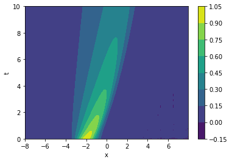

# Example Burgers' equation

In this notebook we provide a simple example of the DeepMoD algorithm by applying it on the Burgers' equation. 

We start by importing the required libraries and setting the plotting style:


```python
# General imports
import numpy as np
import torch
import matplotlib.pylab as plt

# DeepMoD functions

from deepymod import DeepMoD
from deepymod.model.func_approx import NN
from deepymod.model.library import Library1D
from deepymod.model.constraint import LeastSquares
from deepymod.model.sparse_estimators import Threshold,PDEFIND
from deepymod.training import train
from deepymod.training.sparsity_scheduler import TrainTestPeriodic
from scipy.io import loadmat

# Settings for reproducibility
np.random.seed(42)
torch.manual_seed(0)


%load_ext autoreload
%autoreload 2
```

Next, we prepare the dataset.


```python
data = np.load('data/burgers.npy', allow_pickle=True).item()
print('Shape of grid:', data['x'].shape)
```

    Shape of grid: (256, 101)


Let's plot it to get an idea of the data:


```python
fig, ax = plt.subplots()
im = ax.contourf(data['x'], data['t'], np.real(data['u']))
ax.set_xlabel('x')
ax.set_ylabel('t')
fig.colorbar(mappable=im)

plt.show()
```





```python
X = np.transpose((data['t'].flatten(), data['x'].flatten()))
y = np.real(data['u']).reshape((data['u'].size, 1))
print(X.shape, y.shape)
```

    (25856, 2) (25856, 1)


As we can see, $X$ has 2 dimensions, $\{x, t\}$, while $y$ has only one, $\{u\}$. Always explicity set the shape (i.e. $N\times 1$, not $N$) or you'll get errors. This dataset is noiseless, so let's add $2.5\%$ noise:


```python
noise_level = 0.025
y_noisy = y + noise_level * np.std(y) * np.random.randn(y[:,0].size, 1)
```

The dataset is also much larger than needed, so let's hussle it and pick out a 1000 samples:


```python
number_of_samples = 2000

idx = np.random.permutation(y.shape[0])
X_train = torch.tensor(X[idx, :][:number_of_samples], dtype=torch.float32, requires_grad=True)
y_train = torch.tensor(y_noisy[idx, :][:number_of_samples], dtype=torch.float32)
```


```python
print(X_train.shape, y_train.shape)
```

    torch.Size([2000, 2]) torch.Size([2000, 1])


We now have a dataset which we can use. Let's plot, for a final time, the original dataset, the noisy set and the samples points:


```python
fig, axes = plt.subplots(ncols=3, figsize=(15, 4))

im0 = axes[0].contourf(data['x'], data['t'], np.real(data['u']), cmap='coolwarm')
axes[0].set_xlabel('x')
axes[0].set_ylabel('t')
axes[0].set_title('Ground truth')

im1 = axes[1].contourf(data['x'], data['t'], y_noisy.reshape(data['x'].shape), cmap='coolwarm')
axes[1].set_xlabel('x')
axes[1].set_title('Noisy')

sampled = np.array([y_noisy[index, 0] if index in idx[:number_of_samples] else np.nan for index in np.arange(data['x'].size)])
sampled = np.rot90(sampled.reshape(data['x'].shape)) #array needs to be rotated because of imshow

im2 = axes[2].imshow(sampled, aspect='auto', cmap='coolwarm')
axes[2].set_xlabel('x')
axes[2].set_title('Sampled')

fig.colorbar(im1, ax=axes.ravel().tolist())

plt.show()
```


## Configuring DeepMoD

Configuration of the function approximator: Here the first argument is the number of input and the last argument the number of output layers.


```python
network = NN(2, [30, 30, 30, 30], 1)
```

Configuration of the library function: We select athe library with a 2D spatial input. Note that that the max differential order has been pre-determined here out of convinience. So, for poly_order 1 the library contains the following 12 terms:
* [$1, u_x, u_{xx}, u_{xxx}, u, u u_{x}, u u_{xx}, u u_{xxx}, u^2, u^2 u_{x}, u^2 u_{xx}, u^2 u_{xxx}$]


```python
library = Library1D(poly_order=2, diff_order=3) 
```

Configuration of the sparsity estimator and sparsity scheduler used. In this case we use the most basic threshold-based Lasso estimator and a scheduler that asseses the validation loss after a given patience. If that value is smaller than 1e-5, the algorithm is converged.  


```python
estimator = Threshold(0.1) 
sparsity_scheduler = TrainTestPeriodic(periodicity=50, patience=200, delta=1e-5) 
```

Configuration of the sparsity estimator 


```python
constraint = LeastSquares() 
# Configuration of the sparsity scheduler
```

Now we instantiate the model and select the optimizer 


```python
model = DeepMoD(network, library, estimator, constraint)

# Defining optimizer
optimizer = torch.optim.Adam(model.parameters(), betas=(0.99, 0.99), amsgrad=True, lr=1e-3) 

```

## Run DeepMoD 

We can now run DeepMoD using all the options we have set and the training data:
* The directory where the tensorboard file is written (log_dir)
* The ratio of train/test set used (split)
* The maximum number of iterations performed (max_iterations)
* The absolute change in L1 norm considered converged (delta)
* The amount of epochs over which the absolute change in L1 norm is calculated (patience)


```python
train(model, X_train, y_train, optimizer,sparsity_scheduler, log_dir='runs/Burgers/', split=0.8, max_iterations=100000) 
```

     13350  MSE: 2.53e-05  Reg: 1.38e-05  L1: 1.45e+00 Algorithm converged. Writing model to disk.


Sparsity masks provide the active and non-active terms in the PDE:


```python
model.sparsity_masks
```


    [tensor([False, False,  True, False, False,  True, False, False, False, False,
             False, False])]


estimatior_coeffs gives the magnitude of the active terms:


```python
print(model.estimator_coeffs())
```

    [array([[ 0.        ],
           [ 0.        ],
           [ 0.39227325],
           [ 0.        ],
           [ 0.        ],
           [-1.001875  ],
           [ 0.        ],
           [ 0.        ],
           [ 0.        ],
           [ 0.        ],
           [ 0.        ],
           [ 0.        ]], dtype=float32)]


So the final terms that remain are the $u_{xx}$ and $u u_{x}$ resulting in the following Burgers equation (in normalized coefficients: 
$u_t = 0.4 u_{xx} - u u_{x}$.


```python

```
