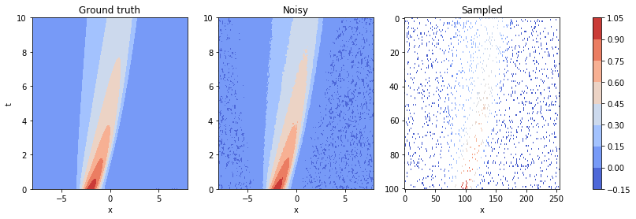

# Example Burgers' equation

In this notebook we provide a simple example of the DeepMoD algorithm by applying it on the Burgers' equation. 

We start by importing the required libraries and setting the plotting style:


```python
# General imports
import numpy as np
import torch
import matplotlib.pylab as plt
# DeepMoD stuff
from deepymod_torch.DeepMod import DeepMod
from deepymod_torch.library_functions import library_1D_in
from deepymod_torch.training import train_deepmod, train_mse

# Settings for reproducibility
np.random.seed(42)
torch.manual_seed(0)


%load_ext autoreload
%autoreload 2
```

    The autoreload extension is already loaded. To reload it, use:
      %reload_ext autoreload


Next, we prepare the dataset.


```python
data = np.load('data/burgers.npy', allow_pickle=True).item()
print('Shape of grid:', data['x'].shape)
```

    Shape of grid: (256, 101)


Let's plot it to get an idea of the data:


```python
fig, ax = plt.subplots()
im = ax.contourf(data['x'], data['t'], np.real(data['u']))
ax.set_xlabel('x')
ax.set_ylabel('t')
fig.colorbar(mappable=im)

plt.show()
```


```python
X = np.transpose((data['t'].flatten(), data['x'].flatten()))
y = np.real(data['u']).reshape((data['u'].size, 1))
print(X.shape, y.shape)
```

    (25856, 2) (25856, 1)


As we can see, $X$ has 2 dimensions, $\{x, t\}$, while $y$ has only one, $\{u\}$. Always explicity set the shape (i.e. $N\times 1$, not $N$) or you'll get errors. This dataset is noiseless, so let's add $5\%$ noise:


```python
noise_level = 0.05
y_noisy = y + noise_level * np.std(y) * np.random.randn(y[:,0].size, 1)
```

The dataset is also much larger than needed, so let's hussle it and pick out a 1000 samples:


```python
number_of_samples = 1000

idx = np.random.permutation(y.shape[0])
X_train = torch.tensor(X[idx, :][:number_of_samples], dtype=torch.float32, requires_grad=True)
y_train = torch.tensor(y_noisy[idx, :][:number_of_samples], dtype=torch.float32)
```


```python
print(X_train.shape, y_train.shape)
```

    torch.Size([1000, 2]) torch.Size([1000, 1])


We now have a dataset which we can use. Let's plot, for a final time, the original dataset, the noisy set and the samples points:


```python
fig, axes = plt.subplots(ncols=3, figsize=(15, 4))

im0 = axes[0].contourf(data['x'], data['t'], np.real(data['u']), cmap='coolwarm')
axes[0].set_xlabel('x')
axes[0].set_ylabel('t')
axes[0].set_title('Ground truth')

im1 = axes[1].contourf(data['x'], data['t'], y_noisy.reshape(data['x'].shape), cmap='coolwarm')
axes[1].set_xlabel('x')
axes[1].set_title('Noisy')

sampled = np.array([y_noisy[index, 0] if index in idx[:number_of_samples] else np.nan for index in np.arange(data['x'].size)])
sampled = np.rot90(sampled.reshape(data['x'].shape)) #array needs to be rotated because of imshow

im2 = axes[2].imshow(sampled, aspect='auto', cmap='coolwarm')
axes[2].set_xlabel('x')
axes[2].set_title('Sampled')

fig.colorbar(im1, ax=axes.ravel().tolist())

plt.show()
```





## Configuring DeepMoD

We now setup the options for DeepMoD. The setup requires the dimensions of the neural network, a library function and some args for the library function:


```python
## Running DeepMoD
config = {'n_in': 2, 'hidden_dims': [20, 20, 20, 20, 20, 20], 'n_out': 1, 'library_function': library_1D_in, 'library_args':{'poly_order': 1, 'diff_order': 2}}
```

Now we instantiate the model:


```python
model = DeepMod(**config)
optimizer = torch.optim.Adam([{'params': model.network_parameters(), 'lr':0.001}, {'params': model.coeff_vector(), 'lr':0.005}])
```

## Run DeepMoD 

We can now run DeepMoD using all the options we have set and the training data. We need to slightly preprocess the input data for the derivatives:


```python
train_deepmod(model, X_train, y_train, optimizer, 25000, {'l1': 1e-5})
```

    | Iteration | Progress | Time remaining |     Cost |      MSE |      Reg |       L1 |
            100      0.40%             371s   2.29e-02   1.64e-02   6.41e-03   1.25e-04 


    ---------------------------------------------------------------------------

    KeyboardInterrupt                         Traceback (most recent call last)

    <ipython-input-21-790b1a88b6d5> in <module>
    ----> 1 train_deepmod(model, X_train, y_train, optimizer, 25000, {'l1': 1e-5})
    

    ~/Documents/GitHub/New_DeepMod_Simple/DeePyMoD_torch/src/deepymod_torch/training.py in train_deepmod(model, data, target, optimizer, max_iterations, loss_func_args)
         67     '''Performs full deepmod cycle: trains model, thresholds and trains again for unbiased estimate. Updates model in-place.'''
         68     # Train first cycle and get prediction
    ---> 69     train(model, data, target, optimizer, max_iterations, loss_func_args)
         70     prediction, time_deriv_list, sparse_theta_list, coeff_vector_list = model(data)
         71 


    ~/Documents/GitHub/New_DeepMod_Simple/DeePyMoD_torch/src/deepymod_torch/training.py in train(model, data, target, optimizer, max_iterations, loss_func_args)
         32         # Optimizer step
         33         optimizer.zero_grad()
    ---> 34         loss.backward()
         35         optimizer.step()
         36     board.close()


    ~/opt/anaconda3/lib/python3.7/site-packages/torch/tensor.py in backward(self, gradient, retain_graph, create_graph)
        193                 products. Defaults to ``False``.
        194         """
    --> 195         torch.autograd.backward(self, gradient, retain_graph, create_graph)
        196 
        197     def register_hook(self, hook):


    ~/opt/anaconda3/lib/python3.7/site-packages/torch/autograd/__init__.py in backward(tensors, grad_tensors, retain_graph, create_graph, grad_variables)
         97     Variable._execution_engine.run_backward(
         98         tensors, grad_tensors, retain_graph, create_graph,
    ---> 99         allow_unreachable=True)  # allow_unreachable flag
        100 
        101 


    KeyboardInterrupt: 


Now that DeepMoD has converged, it has found the following numbers:


```python
print(model.fit.sparsity_mask)
```

    [tensor([2, 4])]


```python
print(model.fit.coeff_vector[0])
```

    Parameter containing:
    tensor([[ 0.0974],
            [-0.9905]], requires_grad=True)

