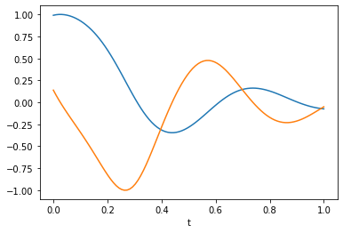

# Example ODE with custom library

In this notebook we provide a simple example of the DeepMoD algorithm by applying it on the a non-linear ODE 

We start by importing the required DeepMoD functions:


```python
# General imports
import numpy as np
import torch
import matplotlib.pylab as plt

# DeepMoD functions


from deepymod import DeepMoD
from deepymod.model.func_approx import NN
from deepymod.model.constraint import LeastSquares
from deepymod.model.sparse_estimators import Threshold, PDEFIND
from deepymod.training import train
from deepymod.training.sparsity_scheduler import TrainTestPeriodic
from scipy.io import loadmat


import torch
from torch.autograd import grad
from itertools import combinations
from functools import reduce
from typing import Tuple
from deepymod.utils.types import TensorList
from deepymod import Library

%load_ext autoreload
%autoreload 2
from scipy.integrate import odeint

# Settings for reproducibility
np.random.seed(40)
torch.manual_seed(0)

```

    The autoreload extension is already loaded. To reload it, use:
      %reload_ext autoreload


    <torch._C.Generator at 0x105245f70>


Next, we prepare the dataset. The set of ODEs we consider here are
$d[y, z]/dt = [z, -z+ 5 \sin y]$ 


```python
def dU_dt_sin(U, t):
    return [U[1], -1*U[1] - 5*np.sin(U[0])]
U0 = [2.5, 0.4]
ts = np.linspace(0, 5, 100)
Y = odeint(dU_dt_sin, U0, ts)
T = ts.reshape(-1,1)
```

Here we can potentially rescale the Y and T axis and we plot the results


```python
T_rs = T/np.max(np.abs(T),axis=0)
Y_rs = Y/np.max(np.abs(Y),axis=0)
```

Let's plot it to get an idea of the data:


```python
fig, ax = plt.subplots()
ax.plot(T_rs, Y_rs[:,0])
ax.plot(T_rs, Y_rs[:,1])
ax.set_xlabel('t')

plt.show()
```





```python
number_of_samples = 500

idx = np.random.permutation(Y.shape[0])
X = torch.tensor(T_rs[idx, :][:number_of_samples], dtype=torch.float32, requires_grad=True)
y = torch.tensor(Y_rs[idx, :][:number_of_samples], dtype=torch.float32)
```


```python
print(X.shape, y.shape)
```

    torch.Size([100, 1]) torch.Size([100, 2])


# Setup a custom library

In this notebook we show how the user can create a custom build library.The library function, $\theta$, in this case contains $[1,u,v, sin(u)]$ to showcase that non-linear terms can easily be added to the library


```python
from torch.autograd import grad
from itertools import combinations, product
from functools import reduce
```


```python
class Library_nonlinear(Library):
    """[summary]

    Args:
        Library ([type]): [description]
    """
    def __init__(self) -> None:
        super().__init__()

    def library(self, input: Tuple[torch.Tensor, torch.Tensor]) -> Tuple[TensorList, TensorList]:
    
        prediction, data = input
        samples = prediction.shape[0]
        poly_list = []
        deriv_list = []
        time_deriv_list = []
        
        
        # Construct the theta matrix
        C = torch.ones_like(prediction[:,0]).view(samples, -1)
        u = prediction[:,0].view(samples, -1)
        v = prediction[:,1].view(samples, -1)
        theta = torch.cat((C, u, v, torch.sin(u)),dim=1)
    
        # Construct a list of time_derivatives 
        time_deriv_list = []
        for output in torch.arange(prediction.shape[1]):
            dy = grad(prediction[:,output], data, grad_outputs=torch.ones_like(prediction[:,output]), create_graph=True)[0]
            time_deriv = dy[:, 0:1]
            time_deriv_list.append(time_deriv)
        
        return time_deriv_list, [theta,theta]

```

## Configuring DeepMoD

Configuration of the function approximator: Here the first argument is the number of input and the last argument the number of output layers.


```python
network = NN(1, [30, 30, 30,30], 2)
```

Configuration of the library function: We select the custom build library we created earlier 


```python
library = Library_nonlinear() 
```

Configuration of the sparsity estimator and sparsity scheduler used. In this case we use the most basic threshold-based Lasso estimator and a scheduler that asseses the validation loss after a given patience. If that value is smaller than 1e-5, the algorithm is converged.  


```python
estimator = Threshold(0.5) 
sparsity_scheduler = TrainTestPeriodic(periodicity=50, patience=200, delta=1e-5) 
```

Configuration of the sparsity estimator 


```python
constraint = LeastSquares() 
# Configuration of the sparsity scheduler
```

Now we instantiate the model and select the optimizer 


```python
model = DeepMoD(network, library, estimator, constraint)

# Defining optimizer
optimizer = torch.optim.Adam(model.parameters(), betas=(0.99, 0.99), amsgrad=True, lr=1e-3) 

```

## Run DeepMoD 

We can now run DeepMoD using all the options we have set and the training data. We need to slightly preprocess the input data for the derivatives:


```python
train(model, X, y, optimizer,sparsity_scheduler, log_dir='runs/coupled2/', split=0.8,  max_iterations=100000, delta=1e-3, patience=100) 
```

     21450  MSE: 2.99e-02  Reg: 3.16e-03  L1: 2.65e+00 Algorithm converged. Writing model to disk.


Now that DeepMoD has converged, it has found the following numbers:


```python
model.sparsity_masks
```


    [tensor([False, False,  True, False]), tensor([False, False,  True,  True])]


```python
print(model.estimator_coeffs())
```

    [array([[0.        ],
           [0.        ],
           [0.99987924],
           [0.        ]], dtype=float32), array([[ 0.        ],
           [ 0.        ],
           [-0.56510067],
           [-1.076641  ]], dtype=float32)]


```python

```
